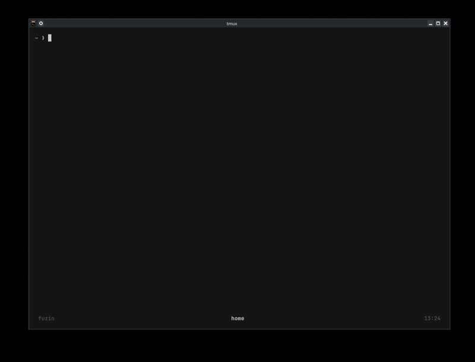

## About the project

I am a chronic distro-hopper. Every time I try to install a package in a distro I have to search either if it exist or what its name is. I've been using bash aliases for using fzf withthe package manager at the time. But as I've said earlier, I'm a distro-hopper. I always change my configs and always forget to bring the alias with me. So I wrote Fuzin to automate my fzf aliases. Even if I'm using Arch, Debian or Mac doesn't matter I'm automatically inside fzf searching for packages.

Fuzin reduced my package installation process quite a bit. I can search packages and even see the package description without leaving my terminal(which I hate doing). If I'm using Arch for example and the package I'm looking for doesn't exist, I can search the AUR. Fuzin can also uninstall packages from my distro. I can seach and remove any package I want. Enough of the talking. You can see Fuzin in action below.

---

## Demo



## Features I like about Fuzin

- **Portable:** Sisteminizde hangi paket yöneticisi varsa (`apt`, `dnf`, `pacman`, `zypper`, `brew`) onu otomatik olarak tespit eder.
- **Multi Selection:** `TAB` tuşu ile birden fazla paketi aynı anda işaretleyip toplu kurulum yapabilirsiniz.
- **Preview Package Descriptions:** Paketleri yüklemeden önce açıklamalarını ve versiyonlarını split-screen (bölünmüş ekran) üzerinden inceleyebilirsiniz.
- **AUR Integration:** Arch Linux kullanıcıları için resmi depoda bulunmayan paketleri otomatik olarak AUR (`yay` veya `paru`) üzerinden arar.

---

## Installation

```bash
git clone https://github.com/Deniz-13/fuzin.git
cd fuzin
chmod +x fuzin
sudo mv fuzin /usr/local/bin/fuzin
```

---

## ⌨️ Kullanım Rehberi (Usage)

Fuzin, karmaşık parametreler yerine basit flagler ile çalışır:

### 1. Paket Arama ve Yükleme

Herhangi bir argüman vermeden çalıştırdığınızda varsayılan olarak "Install" modunda açılır.

```bash
fuzin           # İnteraktif yükleme modunu başlatır
fuzin -i        # Aynı işlevi görür (--install)
```

### 2. Paket Kaldırma

Sisteminizde yüklü olan paketleri listeleyip seçerek silebilirsiniz.

```bash
fuzin -r        # Yüklü paketleri arayıp silmenizi sağlar (--remove)
```

### 3. Sistem Güncelleme

Tüm paket yöneticisi depolarını tek komutla günceller.

```bash
fuzin -u        # Paket listelerini ve sistemi günceller (--update)
```

### 4. Yardım ve Versiyon

```bash
fuzin -h        # Yardım menüsünü görüntüler (--help)
fuzin -v        # Mevcut versiyonu gösterir (--version)
```

---

> **Gelecek Planları:** İlerleyen aşamalarda ağ analizi ve siber güvenlik araçlarını (Nmap, Wireshark, Metasploit vb.) tek tıkla kurabilen özel "toolkit" listeleri eklemeyi planlıyorum.
